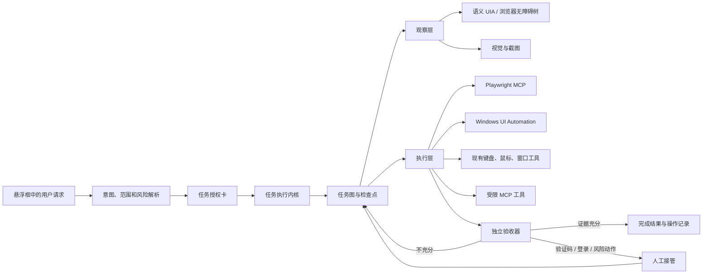

# DeskOrb Agent 演进计划

## 结论

DeskOrb 已经具备一套可用的底座：悬浮对话框、模型适配层、本地桌面输入、Playwright MCP、PowerToys MCP、一次任务授权、高风险二次确认，以及本地端到端探针。下一阶段不该把重点放在增加更多鼠标和键盘指令。真正决定复杂任务完成率的是四件事：可靠地看见界面、把长任务保存成可恢复状态、每一步都有独立证据证明完成、把网页和屏幕中的不可信内容隔离在执行决策之外。

推荐路线是保留当前轻量本地架构，新增一个任务执行内核。不要直接把完整的 Skyvern、browser-use 或 UFO 嵌入产品。它们提供了很好的设计参考，但会带来大体量依赖、运行形态变化，或许可证与产品边界问题。DeskOrb 应复用其中的机制，而不是复制其平台。

## 开源实践带来的判断

| 实践 | 证明有效的做法 | 对 DeskOrb 的结论 |
| --- | --- | --- |
| [Microsoft Playwright MCP](https://github.com/microsoft/playwright-mcp) | 用无障碍树和元素引用完成网页操作；持久 profile 与 isolated profile 分开；并发会争抢同一个持久 profile。 | 保持它作为网页操作首选。默认隔离会话适合测试和公开网页；登录态任务必须明确进入“用户浏览器连接”模式，不能把两者混在一起。 |
| [Skyvern](https://github.com/Skyvern-AI/skyvern) | 页面动作、结构化提取、结果校验和工作流是不同层次的能力。 | 借鉴“动作加校验”的接口。不要接入其整套服务，也不要碰反爬或验证码绕过能力。 |
| [Microsoft UFO](https://github.com/microsoft/UFO) | Windows 桌面任务适合按应用拆分，再以图管理依赖和执行反馈。 | 引入任务图和应用级观察，不急着多 Agent 化。桌面单机版先保持一个编排器，避免并发鼠标操作。 |
| [OpenCUA](https://github.com/xlang-ai/OpenCUA) | 单纯坐标点击远远不够；界面语义定位、内容动作和函数动作要分别评测。 | 桌面定位采用 UI Automation 优先、视觉定位次之、坐标点击兜底的三层策略，并分别记录成功率。 |
| [ego-lite](https://github.com/citrolabs/ego-lite) | Agent 专属浏览空间、用户与 Agent 的显式控制权交接、语义快照和动作批处理。 | 吸收任务空间、交接、批处理和已验证配方的设计；不接入其 macOS 浏览器本体，也不开放其通用 JS、CDP、上传或网络请求能力。 |
| [OSWorld 2.0](https://github.com/xlang-ai/OSWorld-V2) | 长链路评测必须固定版本、隔离环境、保留轨迹和状态验证。 | 当前 11 条探针是好起点，但发布门槛应以可复现的本地 fixture 和虚拟机评测为准，不能以真实用户桌面作为回归环境。 |
| [LiteLLM](https://github.com/BerriAI/litellm) | 多供应商路由需要健康检查、重试、降级、成本与可观测性，而不只是协议转换。 | 保留现有轻量 `ModelAdapter`，在其上加能力注册与可审计路由。LiteLLM 只作为未来可选网关，不应成为当前必需依赖。 |

其中有一个必须正视的安全事实：Playwright MCP 明确不是安全边界，且其历史问题显示网页提示注入和任意代码能力不能被混用。DeskOrb 的 MCP 允许列表和参数策略必须由本地代码强制执行，不能相信模型会自行判断。

## 目标架构



### 核心对象

每个任务创建一份本地 `TaskRecord`，而不是只依赖聊天历史：

```text
task_id, goal, scope, authorization_lease, risk_budget
nodes[], current_node, attempts, observations, evidence
provider_route, browser_mode, handoff_state, outcome
```

每个节点都要有 `precondition`、`action`、`postcondition`、`evidence_schema` 和 `retry_policy`。例如“找到 100 至 150 元 T 恤”不是“搜索淘宝”后就算成功，而是提取出名称、价格、链接、来源时间，并由独立规则确认价格区间。模型的自然语言回答不是成功证据。

## 优先级与执行计划

### P0：守住执行边界和可恢复性

预计 1 周。先做这一层，后续自动化能力才可控。

1. 新建 `task_runtime.py` 和本地 SQLite 任务日志。任务、节点、授权、观察、工具调用、错误和验收证据全部追加记录。程序重启后可以继续、取消或从检查点重试。
2. 把当前“任务级确认”升级为授权租约。授权内容显示目标、允许动作类别、有效期和敏感边界，例如“允许在淘宝搜索和查看商品，不允许下单、登录或发送消息”。同一范围内不重复确认；越出范围立即重新确认。
3. 建立 MCP 能力清单。每个服务器明确可访问域名、是否允许写入、是否允许上传、是否允许执行任意代码。默认禁用 `browser_run_code`、任意 shell 透传和未知的高危 MCP 工具。
4. 将网页文本、OCR 文本、窗口标题和剪贴板内容标记为不可信数据。它们不能修改系统指令、授权范围、工具策略或模型供应商。
5. 实现失败分类：网络、模型、工具、页面状态变化、验证码、登录、权限不足、验收失败。只对幂等读操作自动重试，写动作必须重新观察后决定。

验收：在进程重启、MCP 超时、浏览器崩溃三种故障中，任务不重复提交、不丢失当前授权，且能给用户准确说明下一步。

### P1：让桌面和网页“看得准”

预计 2 周。目标是降低坐标点击依赖。

1. 增加 Windows UI Automation 观察器，优先使用 `pywinauto` 的 UIA 后端或原生 UI Automation。输出窗口、控件名称、AutomationId、控件类型、可点击性和矩形位置。
2. 为每次桌面操作引入定位优先级：UIA 精确元素，窗口内视觉目标，带新鲜快照约束的坐标。坐标模式只在前两种不可用时使用。
3. 将桌面动作封装为语义工具，如 `desktop.activate_window`、`desktop.find_control`、`desktop.invoke_control`、`desktop.set_value`，同时保留当前输入工具作为最后一层执行器。
4. 浏览器区分两个会话模式：`isolated` 用于评测和公开任务，`user-browser` 仅在用户主动连接已有浏览器标签页后启用。第二种模式要在 UI 上持续显示“正在使用你的登录态”。
5. 加入模态框、下载、跨标签页、加载中和失焦检测，避免模型把临时页面状态误判为完成。

### 浏览器任务空间与交接机制

借鉴 ego-lite 的任务空间设计，但不依赖它的浏览器本体。DeskOrb 的浏览器执行层增加 `BrowserBackend` 接口，并把每个网页任务绑定为一个 `BrowserTaskSpace`。任务空间包含后端类型、标签页集合、所有者、任务 ID、授权租约、检查点和当前状态。它和普通聊天历史分开保存。

第一批后端只有两个：

1. `isolated-playwright`：默认后端，不继承用户登录态。用于公开网页、测试、检索和不需要账号的任务。
2. `connected-playwright`：用户主动在 Chrome 或 Edge 的 Playwright 扩展中选定标签页后才能启用。悬浮框持续显示“正在使用你的浏览器登录态”，任务结束后主动断开，不把 Cookie、密码或页面正文写入日志。

任务空间只允许一个控制者。状态为 `agent`、`user`、`waiting-human` 或 `completed`。登录、短信、二维码、人机验证、敏感账号选择，或用户在浏览器里主动接管时，运行时必须冻结后续动作，展示交接卡并交出控制权。用户点击“继续”后，Agent 先重新快照和验证原检查点，再继续。不能自动夺回控制权，也不能把被用户接管当作可重试错误。

ego-lite 把多步网页操作放进一段 JavaScript 中，以减少来回调用。DeskOrb 只吸收“批处理”的性能思想，不开放通用 JavaScript、CDP、文件上传、下载或任意网络请求。新增的 `BrowserActionBatch` 只能包含已授权的语义动作：导航、快照、按页面引用点击、填值、等待、切换标签、提取和验证。运行时逐项检查作用域、风险与页面变化；遇到提交、发送、上传、下载、跨域跳转、登录态访问或人工交接，立即中止批次并按策略处理。

把已验证任务沉淀为本地“网页操作配方”，而不是训练记忆。配方保存站点来源、任务类型、稳定定位器、前置条件、验收器、失败类别和版本号，绝不保存 Cookie、密码、用户输入、页面正文或截图。只有本地 fixture 或真实任务的验收器通过后才允许写入；首次复用必须再次验证，连续失败自动禁用该配方。这样可以逐步减少重复试错，又不会把过去的网页指令变成隐形权限。

ego-lite 当前仅支持 macOS，且其 Skill 会调用通用页面 JS、CDP、上传和网络请求。因此它不作为 DeskOrb 当前依赖或默认后端。等其 Windows 版本可用后，可以在 `BrowserBackend` 下增加可选 `ego` 适配器，仍使用 DeskOrb 的授权、交接、日志脱敏和验收器。

验收补充：对同一个需登录的 mock 站点，验证用户标签页连接、人工接管、继续、断开四个阶段；用户接管期间零 Agent 动作；任务结束后无法继续使用该登录态空间。每个 `BrowserActionBatch` 都要证明没有包含未授权动作，且任何中途页面变化都会触发重新快照。

验收：本地 fixture 的网页检索、记事本保存、窗口切换各运行 20 次，定位成功率达到 95%，不允许靠固定屏幕坐标通过。

### P2：把复杂请求变成可验证的工作流

预计 2 周。

1. 使用轻量 DAG 规划器，不引入完整工作流框架。节点包括观察、导航、提取、比较、修改、等待、人工接管、验证和汇总。
2. 每个工具调用后运行对应的验收器。验收器优先使用确定性规则和页面语义，不把“模型说做完了”作为依据。
3. 引入有限恢复策略：重新观察、换语义定位器、回退上一个检查点、换备选搜索入口。每个节点有最大尝试次数和时间预算，禁止无限循环。
4. 增加“人工接管卡”：当检测到登录、短信验证、二维码、人机验证或账号选择时，冻结自动动作，告诉用户操作原因和继续按钮。用户完成后采集新状态继续，而不是重新执行整个任务。
5. 在悬浮框展示简短进度：当前目标、正在做什么、下一项风险、已验证证据。默认不展示冗长内部推理。
6. 任务图中的浏览器节点必须引用 `BrowserTaskSpace`。节点完成后关闭临时标签页；仅在用户明确要求保留、正在人工接管，或结果只能通过活页面交付时保留标签页。

验收：淘宝商品发现这类任务即使被登录拦住，也必须正确标记为“需要人工接管”，不能虚报已找到商品；在 mock 网站上的端到端成功率达到 90% 以上。

### P3：让多模型成为可靠性能力，而非设置页功能

预计 1 周。

1. 新增 `ProviderCapabilityRegistry`。记录供应商是否支持图像、工具调用、结构化输出、流式输出、上下文长度、区域与数据保留策略、近期健康状态和延迟分位数。
2. 把现有 `ModelAdapter` 的协议转换和“任务路由”分开。路由只在任务开始或明确的恢复点发生，不在任务中静默把含屏幕或网页数据的请求切到另一个供应商。
3. 给每个路由留下可解释记录：为什么选择此模型、失败是否允许降级、实际耗时、输入输出 token 和工具成功率。
4. 先实现同一隐私级别内的主动健康检查、指数退避和确定性降级。跨供应商降级必须在授权卡中预先列出，用户可以关闭。
5. 维护一个无敏感数据的能力基准，分别测纯问答、工具规划、网页结构理解、中文桌面指令和错误恢复。不要只用单次响应速度选模型。

验收：注入超时、429、无效工具调用时，任务能选择允许的备选模型或给出可恢复错误；不发生未授权的数据跨供应商发送。

### P4：把评测变成持续工程能力

预计 2 周，可与 P3 部分并行。

1. 将现有 11 条数据集扩至 60 条本地可复现任务，覆盖网页检索、信息提取、文件与窗口操作、错误诊断、登录和验证码人工接管、风险拒绝、恢复与取消。
2. 每条任务至少三次独立运行，记录任务完成率、步骤完成率、首次成功率、平均与 p95 时延、人工接管率、每任务成本、误确认率和越权调用数。
3. 为每条任务保存结构化轨迹、截图哈希、关键页面快照和验收器输出。秘密、窗口正文、剪贴板和真实账号信息默认脱敏或不保存。
4. 引入故障注入 fixture：延迟加载、弹窗遮挡、元素改名、网络中断、浏览器重启、工具超时。它比在真实淘宝或真实 QQ 上反复试验更安全，也更能定位回归。
5. 使用 OSWorld 作为独立的阶段性外部基准，不把其分数与 DeskOrb 真实用户成功率混为一谈。固定其发布标签、任务资产和运行环境。

验收：每次合并前跑本地回归；每周输出按任务类别和模型拆分的结果。发布门槛是零越权、零未验证成功、关键 fixture 成功率不低于基线且 p95 时延不恶化超过 20%。

## 两个值得做的产品创新

### 证据驱动的任务完成

常见 Agent 在最后给出一句“已完成”，但这句话没有证明力。DeskOrb 可以把结果呈现为一张很小的证据卡：做了什么、在哪里验证、关键字段是什么、是否需要用户继续。这个能力对价格筛选、文件保存、设置修改、故障诊断都通用，也能自然避免虚报。

### 有范围的自动化授权

用户真正需要的不是每点一下就确认，也不是永久放开控制权。授权应当绑定任务范围和风险预算，例如“本次允许打开浏览器、搜索、阅读和填写未提交表单；购买、发送、上传、删除和权限变更仍需确认”。它把确认次数从按点击计算改为按风险边界计算，能同时改善体验和安全性。

## 不建议现在做的事

- 不做验证码识别、绕过或第三方打码接入。只做检测、冻结、提示与恢复。
- 不把所有 MCP 服务和工具模式一次性塞给模型。按意图路由并只加载已授权服务。
- 不默认接管用户真实 Chrome profile。真实登录态必须是用户显式连接的模式。
- 不用多 Agent 并行驱动一套鼠标和键盘。桌面焦点是排他的，先把单编排器做可靠。
- 不以真实账号、真实聊天联系人或真实购物网站的偶然成功作为回归测试标准。

## 建议的落地顺序

先实施 P0，再实施 P1 和 P2。P3 与 P4 在 P1 的接口稳定后并行推进。这样大约 6 至 8 周能把项目从“能演示的桌面助手”推进为“能解释、能恢复、能度量的桌面 Agent”。
