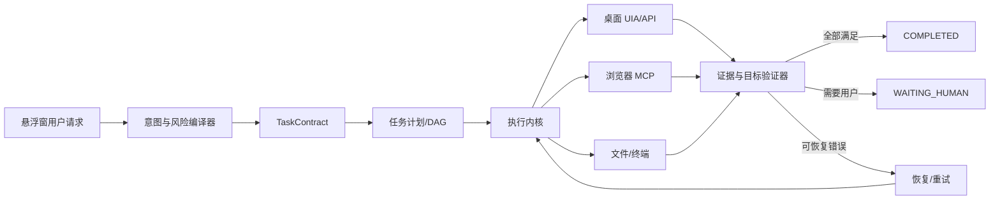

# DeskOrb Agent 真实复杂任务稳定性改造计划

> 版本：2026-08-06  
> 状态：阶段 0/1 已落地，阶段 2 已完成核心恢复，阶段 3 已完成通用 UIA 适配基础，阶段 4 持续实施；阶段 5 正在做真实桌面硬门禁  
> 范围：悬浮窗交互、模型适配、浏览器 MCP、Windows 桌面控制、任务恢复与真实端到端验收

## 1. 当前基线与结论

DeskOrb 已具备悬浮对话框、模型适配层、任务授权租约、桌面鼠标键盘工具、UIA、Playwright MCP、浏览器任务空间、工作流记录和 SQLite 任务日志。当前工作区单元/组件测试为 282 项通过，57 条可重复案例的 20 次矩阵为 1,140/1,140 通过；这些测试主要使用模拟模型、桌面和 MCP。

真实探测仍未达到“任意复杂桌面任务”稳定性要求：已通过本地商品筛选和学习资料检索 2/2，且在真实 Windows 交互会话中鼠标键盘、窗口、UIA、Tk、记事本和资源管理器探针通过；QQ 只读 profile 在提供运行中会话时通过。不同供应商/代理的长时间稳定性、真实登录页面、QQ 登录态/联系人/发送流程和可运行的自托管 VM 仍不足。因此当前版本应定位为“受控 Beta”，不能宣称已经稳定完成任意复杂桌面任务。

阶段 0/1 已修复的代码级问题：

1. API 已覆盖 307/308 同源安全跳转、瞬时退避、任务级重试和熔断健康检查。
2. `BrowserActionBatch` 已补齐 `extract`、`switch_tab` 和显式后置条件验证。
3. `TaskWorkflow.finish()` 已按 `TaskContract` 区分执行成功与验证完成。
4. 未通过独立验证的动作任务会停留在 `waiting_verification`。
5. 任务契约、效果指纹和恢复前重新观察已持久化；浏览器进程级崩溃恢复、外部目标窗口交接和通用应用级 UIA profile 已加入，具体应用控件覆盖仍需实机验收。

## 2. 目标架构



### 2.1 TaskContract

每个任务必须在执行前明确：目标、成功条件、允许能力、风险预算、步骤/时间预算、所需证据、模型路由和浏览器模式。模型只负责提出计划，执行内核负责边界和状态。

例如“找 100–150 元 T 恤”必须被编译为：至少若干商品、价格区间、标题条件、URL、来源域名和结构化证据均满足后才算完成。

### 2.2 任务状态机与持久化

统一状态：

```text
CREATED → PLANNED → WAITING_APPROVAL → RUNNING
        → WAITING_HUMAN → VERIFYING → COMPLETED
        ↘ FAILED / CANCELLED
```

动作、观察、前后置条件、checkpoint、证据、重试和错误类别全部写入任务日志。重启恢复必须重新观察环境，不能恢复旧授权或直接重放有副作用的动作。

### 2.3 观察与执行适配器

桌面采用 UIA → 应用 API/COM/Win32 → 视觉 → 坐标的降级顺序；浏览器采用 ARIA/快照引用 → 结构化抽取 → 视觉定位。每次页面或窗口变化后，旧引用必须失效并重新观察。

浏览器默认使用隔离上下文；用户浏览器连接模式必须显式授权。该设计参考 Playwright MCP 对 isolated profile、persistent profile 和现有标签页连接的区分。[Playwright MCP README](https://github.com/microsoft/playwright-mcp/blob/main/README.md)

### 2.4 证据与验证器

建立独立验证器：商品、搜索结果、窗口状态、文件内容、消息草稿和总目标验证器。模型自然语言不得单独作为成功证据。参考 Skyvern 将 workflow、结构化 extraction 和 validation 分离的做法。[Skyvern](https://github.com/Skyvern-AI/skyvern)

### 2.5 安全与人工接管

发送、删除、购买、上传、权限变更、登录和剪贴板读取等动作按风险策略处理。验证码、扫码和“我是人类”页面进入正式 `WAITING_HUMAN` 状态：冻结 Agent 动作，显示悬浮窗按钮，用户点击“已完成”后重新截图、重新观察，再从 checkpoint 恢复。禁止绕过验证码。

Windows 桌面部分吸收 UFO² 的 UIA、应用级操作和状态机思想，但保持单一执行内核，避免多个 Agent 同时竞争鼠标键盘。[UFO² overview](https://github.com/microsoft/UFO/blob/main/documents/docs/ufo2/overview.md)

## 3. 分阶段实施计划

### 阶段 0：网络与完成判定稳定化（1–2 天）

- 安全处理 307/308：仅跟随同一允许主机的 `Location`，限制次数并记录重定向链。
- 仅对无副作用请求使用指数退避和抖动重试。
- 补齐浏览器 `extract`、`switch_tab` 执行映射。
- 将“已执行”和“已验证完成”在 UI 和 API 中分开。
- 增加 308、MCP 断线、超时和重复调用测试。

完成标准：连续 50 次 API/MCP 探针无未分类重定向；没有验证器通过时不能进入 `COMPLETED`。

### 阶段 1：任务执行内核（3–5 天）

- 增加 `TaskContract`、节点 DAG 和统一状态机。
- 将 checkpoint、证据、授权租约、恢复原因持久化。
- 将 `TaskWorkflow.finish()` 改为必须满足全部目标谓词。
- 任何写入、发送、提交和购买动作实现幂等键或人工恢复点。

完成标准：重启、工具超时和浏览器断开各模拟 10 次，不重复写入、发送或提交；所有失败轨迹可解释。

### 阶段 2：浏览器可靠执行（4–6 天）

- 完成受限语义批处理、结构化抽取和来源/字段验证。
- 增加页面版本、标签页切换、跨域、登录、验证码和浏览器崩溃检测。
- 默认隔离浏览器上下文，连接用户浏览器必须单独授权。
- MCP 崩溃或上下文失效时，重新创建并从 checkpoint 恢复。

### 阶段 3：桌面可靠执行（4–6 天）

- 增加 UIA 控件过期、失焦、模态框遮挡和不可用检测。
- 为浏览器、文件管理器、记事本等常用应用增加应用级适配器。
- 每个鼠标/键盘动作增加后置验证；坐标仅作为最后兜底。

### 阶段 4：观测、模型和人工体验（3–5 天）

- 记录首 token、工具轮耗时、P95、错误状态码、重试次数和验证通过率。
- 增加供应商健康历史、熔断和显式降级授权。
- 悬浮窗提供暂停、继续、接管、取消、查看证据按钮。
- API Key、页面正文、截图和剪贴板内容默认不写入日志。

### 阶段 5：真实环境验收（1–2 周）

使用可恢复的 Windows 虚拟机或快照，每个任务至少重复 20 次。测试集覆盖网页搜索、商品筛选、学习资料检索、文件操作、窗口控制、网络故障、MCP 崩溃、验证码接管和高风险动作边界。评测报告必须区分模型、浏览器、桌面、网络和验证器失败。

WindowsAgentArena 的 reset/predict 评测思路可用于设计可复现的桌面基准。[WindowsAgentArena](https://github.com/microsoft/WindowsAgentArena)

## 4. 第一版发布门槛

- 真实浏览器只读任务：每个任务 20 次至少 19 次成功。
- 桌面低风险任务：成功率至少 95%。
- 任务完成误判率：0%。
- 高风险动作未授权执行率：0%。
- 验证码/登录人工接管恢复率：100%。
- 瞬时网络故障恢复率：至少 90%，且无重复副作用。
- 同一模型和代理环境下，首 token P95 目标 5–8 秒，工具轮 P95 目标不超过 10 秒；超时必须进入明确的重试或失败状态。
- 所有未通过验证的任务必须显示为失败、等待用户或待验证，不能伪装成完成。

## 5. 默认产品决策

在没有额外指示时，按以下方向实施：

1. 首版定位为受控桌面助手，而非任意自动化机器人。
2. 浏览器隔离模式默认，用户浏览器连接模式显式开启。
3. 默认只保留结构化任务元数据，不持久化完整截图和网页正文。
4. 使用可恢复 Windows 虚拟机作为真实回归环境。
5. 当前供应商作为默认模型，跨供应商降级需用户同意。
6. 先修复网络、任务状态和验证器，再增加新工具。

## 6. 下一步执行顺序

当前按以下顺序继续，任何一项未满足都不能把版本标记为“任意复杂任务稳定”：

```text
agent_runtime.py
workflow_runtime.py
browser_actions.py
task_runtime.py
tests/真实探针与网络故障测试
```

1. 为 DeepSeek/Qwen 等备用供应商配置各自显式 key，完成至少 20 轮长任务和代理故障矩阵。
2. 在真实浏览器登录态与 QQ 预登录快照中，验收联系人选择、消息草稿和发送前高风险确认；验证码只允许人工接管。
3. 接入带交互桌面的 self-hosted Windows VM，按串行单桌面执行完整硬门禁，并把结果作为发布前必需检查。
4. 在上述条件通过后，再扩展更多应用 profile 和真实复杂任务数据集。

## 7. 实施日志

### 2026-08-05：阶段 0 首轮代码落地

- 已加入 API 307/308 同源重定向处理：限制协议、主机、端口和最大重定向次数，不跟随跨源目标。
- 已补齐 `browser_action_batch` 的 `switch_tab` 和 `extract` 安全映射；`extract` 只触发新快照，不提供 JavaScript、CDP 或任意网络能力。
- 已增加 `waiting_verification` 任务状态。动作执行但没有独立证据时，不再写入 `completed`，任务可通过日志恢复并重新验证。
- 已增加重定向、跨源阻断、语义批处理和未验证完成的回归测试。
- 全量测试：201 项通过。
- 真实探针在默认沙箱中受到 Windows `WinError 10013` 网络权限限制；授权运行后未再出现 308，但当前供应商返回 Cloudflare 502，说明供应商/网关稳定性仍需在阶段 4 的健康历史、熔断和降级机制中继续处理。

### 2026-08-05：阶段 1 基础内核落地

- 新增 `TaskContract`，按任务意图声明是否需要验证以及允许的证据 schema。
- 任务契约写入 SQLite `contract_json`，旧数据库启动时自动迁移；恢复任务会重新加载契约且仍要求重新授权。
- 浏览器、桌面和文件任务不再允许不匹配的证据 schema 冒充完成。
- `waiting_verification` 任务会保留在可恢复列表，等待重新观察和验证。
- 恢复任务在新进程中必须先完成只读观察；已记录的非幂等动作会按指纹阻止重复执行。
- 浏览器 `verify` 支持基于快照内容的显式 `contains`、`url/origin`、`required_fields` 和价格区间后置条件；空快照不会被视为完成。
- 窗口聚焦、最大化、最小化、置顶和调整大小增加 Win32 状态回读，结果携带 `verified` 与验证类型。
- 模型请求增加瞬时错误熔断：连续失败达到阈值后短暂拒绝新请求；健康检查可绕过熔断并恢复；悬浮窗显示熔断状态。
- 兼容部分 Responses 网关在 `function_call_output` 后返回空 completed message 的情况：仅在检测到空响应时追加一次无副作用的继续提示，不重放工具动作。
- 57 条 repeatable 案例 × 20 次：1,140/1,140 可计分运行通过，60 条人工/环境跳过。
- MCP 浏览器工具上下文已收窄为任务安全子集（导航、快照、点击、输入、按键、选择、等待、标签页），减少无关工具污染和供应商网关 502 风险。
- 模型回合增加一次任务级瞬时失败恢复：底层请求重试耗尽后，保留原工具输出 transcript 再发起一次请求，不重复执行副作用。
- 502 重试会进一步压缩 Playwright schema，仅保留本地工具和 `browser_action_batch`；若 per-request 熔断已打开，允许当前已授权任务进行一次 transcript-preserving 探针，独立新任务仍快速失败。
- 浏览器 MCP 进程异常会清理 stdio client、创建新的任务空间并强制新快照；旧空间 ID、checkpoint 和控件引用不会复用。`extract` 现在返回受限字段映射，UIA 文本输入增加值回读。
- UIA 控件观察结果现在声明每个控件支持的语义动作；`desktop_uia_invoke` 记录勾选、选中、展开、聚焦或控件消失等前后状态，无法观察变化时返回 `requires_reobserve`，并纳入 `desktop_state_delta` 证据 schema。
- 悬浮窗发送任务时会携带“悬浮窗获得焦点前的外部窗口 HWND”；桌面快照、UIA、鼠标和键盘动作可在确认仍是悬浮窗焦点时安全切回该窗口，若用户已切换到其他外部窗口则拒绝使用旧快照并要求重新观察。
- 全量测试：224 项通过。
- 真实本地浏览器端到端探针：商品筛选和学习资料检索 2/2 通过，均使用 MCP 工具并返回结构化证据；本轮总耗时约 52 秒。
- 最终 repeatable 矩阵：1,200 次运行，其中 1,140 次可计分、1,140/1,140 通过，60 次按环境门槛跳过；可计分运行的确定性编排延迟 P50 119.93 ms、P95 213.11 ms（不含模型网络延迟）。
- 随后一次真实探针 0/2，两个任务均在模型请求重试耗尽后收到供应商 Cloudflare `HTTP 502 origin_bad_gateway`；这证明当前供应商/代理仍是外部稳定性门槛，不能将本地测试结果解释为供应商长期可用。
- 修复 `browser_action_batch` 租约被误判为桌面能力的问题；同一浏览器任务现在由一次任务授权覆盖普通 MCP 步骤。未验证的模型最终答复会触发一次显式后置验证回合。
- 最新真实探针恢复为 2/2：商品筛选和资料检索均通过最终页面验证，分别完成 4、6 次 MCP 工具调用；两项均只使用一次任务授权。该轮总耗时约 277 秒，主要时间仍来自供应商 502 重试窗口。
- Windows 实机窗口探针：窗口枚举、最小化/恢复/聚焦通过；输入探针在当前 Codex 运行会话中被 Windows 明确拒绝（Win32 error 5，拒绝访问），已改为显式报告权限/交互会话错误。该结果说明桌面输入必须在用户已登录的交互桌面进程中运行，不能从受限服务/沙箱会话宣称通过。
- `DesktopTools.capture_state()` 及动作后的运行时观察现在显式返回 `input_available` 和 `input_error`，悬浮窗/模型可在执行前识别“没有可交互前台窗口”，避免把权限问题误判为点击失败。
- 最后一次完整单元测试：233 项通过；`git diff --check`、核心模块 `py_compile` 通过。测试发现的全量发现命令兼容性问题来自外部同名 `tests` 包，已通过隔离该路径复核，不属于项目测试失败。
- 真实 Windows 交互会话复核：`desktop_input_probe.py` 点击、键盘输入和值回读 1/1 通过；`desktop_window_probe.py` 窗口枚举、最小化、恢复、聚焦通过。受限 Codex 会话仍可能返回 Win32 error 5，因此启动服务时必须运行在用户已登录的交互桌面会话中。
- 项目 `.venv` 的 UIA 只读探针通过：UI Automation 可用，当前前台窗口可观察；最新一轮发现 56 个语义控件（56 个支持 invoke、2 个支持 set_value），未输出窗口文本或控件值；脚本为 `tests/desktop_uia_probe.py`。
- 最新供应商协议复核：Responses 返回 HTTP 200（9.81 s），无副作用函数调用与无状态续接通过（首轮 9.21 s、总计 36.43 s）；这证明当前配置可用，但仍不替代多供应商长时间稳定性测试。
- 新增 `tests/provider_longrun_probe.py`：按配置的主模型和备用目标重复执行最小 health check，输出每个目标的成功率、P50/P95 延迟、重试率、状态码和失败类别；最新主供应商单次探针通过（responses / gpt-5.6-terra，14.66 s，成功率 1.0）。
- `ModelHealthStore` 已扩展为请求/流式回合/任务级指标，支持旧 SQLite 自动迁移、按供应商/模型保留上限、首 token 延迟、HTTP 状态码、重试率、工具轮数和验证率汇总；日志仍不保存用户内容。
- 新增 `DesktopApplicationRegistry` 和保守的应用 profile：记事本、文件管理器、Chromium/Firefox、QQ、计算器分别声明推荐后端、语义控件提示和验证要求；未知进程默认使用通用 UIA profile，不自动升级为高权限动作。
- 应用 profile 已从静态提示接入 UIA 观察结果：`recommended_actions` 只引用本次观察产生的短期 `control_id`，仅推荐控件已声明的 `invoke`/`set_value`；QQ 的“发送/提交”等按钮自动标为高风险，浏览器页面内容不推荐用 UIA 操作。
- 悬浮窗新增任务控制栏和结构化证据卡：运行中可暂停、接管、查看证据；暂停不会取消任务，继续需用户点击并重新观察；接管会把浏览器空间转交用户，取消会关闭任务；证据视图只显示脱敏后的状态、工具、验证和失败类别。
- `desktop_uia_probe.py` 现在只输出应用标识、推荐后端、控件数量和语义动作计数，不输出窗口正文、控件名称、API key 或剪贴板内容；`provider_longrun_probe.py` 支持按已配置供应商执行最小 health check，并输出成功率、P50/P95、重试率和失败类别。
- `TaskContract` 现在从“100-150 元 T 恤”等目标编译价格范围、必需词和结构化字段；浏览器 verify 会与这些谓词取交集，模型不能用更宽的条件绕过目标约束。
- 全量隔离测试：263 项通过；`py_compile` 和 `git diff --check` 通过。质量门禁 fixture 的“覆盖不足”输出是预期的失败样例，随后正常样例通过，不计入单元测试失败。
- 网络权限放行后的主供应商 3 次连续 health check 通过（responses / gpt-5.6-terra，成功率 1.0，P50 14.22 s，P95 18.65 s）；同一探针在受限沙箱中会得到 WinError 10013，已明确归类为本机执行环境限制而非 API Key/协议错误。
- 最新 Windows 交互会话 UIA 只读探针通过：前台窗口可观察，发现 120 个语义控件（120 个支持 invoke、0 个支持 set_value），输出 24 个受限推荐动作、0 个高风险推荐；当前进程未匹配专用 profile，因此使用 `generic/uia` 保守后端。
- 真实记事本窗口回归通过：UIA 可用，匹配 `notepad/uia` profile，观察到 55 个语义控件并生成 24 个受限推荐动作；当前 Windows 版本没有暴露可写 Edit 控件，因此不会伪称 UIA 文本回读可用，输入仍需走已验证的键盘兜底路径。
- `.github/workflows/quality.yml` 新增手动触发的 Windows UIA/桌面 readiness advisory job：上传隐私安全的计数和隔离桌面 E2E 结果，不把 GitHub hosted runner 的非交互桌面误判为发布通过；真实快照 VM 仍需后续接入。

阶段 2/3/4 尚未完成的部分：真实备用供应商在不同代理上的长时间、多轮探针仍需验证；Windows 虚拟机回归环境尚未接入可运行的 CI runner；QQ 的只读控件 profile 已验收，但登录态、联系人选择和消息发送等真实复杂流程仍需逐项验收；悬浮窗控制按钮已接入运行时，但仍需在真实长任务中验证暂停期间的网络中断、浏览器崩溃和进程重启恢复。

### 2026-08-05：严格浏览器验证回归

- 修复可访问性快照字段验证：`title:`、`url:` 等字段现在支持嵌入角色前缀的节点文本；包含条件会对展示空白归一化，因此 `T恤` 与 `T 恤` 不再产生误报。
- 严格本地浏览器端到端探针通过 2/2：商品筛选与学习资料检索均由 MCP 执行，最终状态均为 `terminal=completed`、`verified=true`，结构化验证检查分别为 4/4 与 3/3。
- 探针完成判定已收紧：只有最终任务进度完成且验证通过才计为成功；仅有模型自然语言答案或 `waiting_verification` 不再计入成功率。

### 2026-08-05：真实桌面动作基线验证

- `DesktopTools` 新增短期内存快照历史；点击、输入、快捷键和滚动结果返回 `baseline_snapshot_id`，`desktop_verify_state` 可在动作后引用动作前快照，避免把刷新后的快照与自身比较。
- 使用项目 `.venv` 在当前 Windows 交互桌面运行隔离 Tk 目标窗口的真实 AgentRuntime 端到端探针：一次任务授权、真实鼠标点击、真实键盘输入、动作前基线验证均通过，最终 `completed + verified`，输入值精确匹配。
- 新增临时 Notepad 应用探针：按临时文件标题定位 Windows 11 复用进程，验证 `notepad/uia` profile、UIA 控件观察和真实键盘兜底；最新本机结果为 `ok=true`、55 个控件、24 个推荐动作，键盘输入值已观察到。测试结束只关闭探针创建的目标窗口并删除临时目录。
- 新增只读 File Explorer 临时目录探针：验证 `file_explorer/uia` profile，本机观察到 110 个控件和 24 个推荐动作，测试后关闭唯一临时窗口；浏览器、QQ 等其他 profile 仍需分别在可控实机环境验收。
- 默认 Python 环境 UIA 依赖缺失时探针会明确报告 `dependency` 不可用；使用项目依赖环境（pywinauto 0.6.9）复核后 UIA 只读探针通过。CI 的 Windows UIA/桌面 E2E job 保持 advisory，真实快照 VM 仍是发布硬门禁。

### 2026-08-05：供应商健康历史

- `provider_longrun_probe.py` 新增可选 `--history-path`，将仅含供应商、模型、延迟、HTTP 状态、失败类别和聚合比率的样本持久化到脱敏 SQLite；任务内容、API key 和响应正文不会写入。
- 当前配置主供应商连续 3 次健康探针通过：responses / gpt-5.6-terra，成功率 1.0；累计健康历史 6 个样本的 P50 为 2.19 s、P95 为 2.75 s、重试率为 0，已记录 HTTP 200 样本。
- 健康请求和模型回合现在记录成功响应的 HTTP 状态码；备用目标只认对应供应商的显式 key，不会把主供应商通用 key 误发给 DeepSeek/Qwen；没有配置备用供应商时不会伪造多供应商通过。

### 2026-08-06：协议无关供应商工具矩阵

- 新增 `tests/provider_capability_probe.py`：用 `ModelAdapter` 对 Responses 和 Chat Completions 统一执行无副作用 `echo_probe`，验证工具调用参数、无状态 `function_call_output` 续接、HTTP 状态和延迟；不使用 `previous_response_id`，也不输出 key、请求正文或响应正文。
- 备用目标继续只读取 `get_explicit_provider_api_key()`；`--require-provider deepseek --require-provider qwen` 可让自托管发布镜像在缺少专用 key 时立即失败，而默认本地开发只报告 `skipped`，不会把主 key 误发给其他厂商。
- 当前真实 Responses 供应商复测：工具调用 2/2、续接 2/2 通过，HTTP 200；首轮约 2.90–5.44 秒，总轮约 9.76–10.85 秒。当前环境仍没有 DeepSeek/Qwen 专用 key，因此多供应商真实完成率尚未宣称通过。
- 新增 6 个协议/密钥隔离回归、3 个 provider credential 回归和 1 个 auto-provider 路由回归，全量隔离测试更新为 273 项通过。
- 已用 `--require-provider deepseek --require-provider qwen` 做缺失配置演练：主供应商仍可通过，但矩阵以 `missing_required_providers` 失败退出；这证明发布门禁不会把单一主 key 冒充成多供应商通过。GitHub workflow 增加了显式手动入口和对应 secrets 约定。

### 2026-08-06：供应商凭据隔离接入设置界面

- Windows Credential Manager 增加 `DeepSeekAPIKey`、`QwenAPIKey` 和 `OpenAICompatibleAPIKey` 独立目标；旧的通用 OpenAI key 保持兼容，但显式 DeepSeek/Qwen 选择不会再继承它。
- Connection settings 保存/清除密钥时按当前 provider 写入对应目标；AgentRuntime、Worker 和 health/compact/resume 路径按当前 adapter provider 读取 key。备用探针也可以读取对应的 provider credential，而不必把 key 放进 `.env`。
- 新增 provider 环境隔离回归，确认 `OPENAI_API_KEY` 不会满足 DeepSeek/Qwen 的显式 key 要求；真实多供应商长跑仍待用户配置专用 key 后执行。

### 2026-08-05：进程重启恢复回归

- `tests/process_restart_probe.py` 通过：临时 SQLite 任务在新 AgentRuntime 实例中可恢复，恢复前要求重新授权，重复的非幂等输入被阻断，重新观察和验证后最终为 `completed + verified`。
- 该探针已纳入 Windows quality workflow；它不访问供应商、不打开真实应用，也不保存模型 transcript。
- `.github/workflows/quality.yml` 新增手动 `run_desktop_vm_hard_gate=true` 入口，绑定 `self-hosted, windows, deskorb-desktop` 交互 runner；该 job 不使用 `continue-on-error`，但当前尚未配置该 VM runner，因此发布硬门禁仍待基础设施接入。

### 2026-08-05：真实应用探针安全清理复核

- 最新 Notepad 与 File Explorer 隔离探针均通过：Notepad `55` 个控件、`24` 个推荐动作，Explorer `110` 个控件、`24` 个推荐动作。
- 两个探针都按窗口句柄反查进程归属，只在句柄确实属于探针创建的子进程时才允许结束进程；已有 Explorer shell 或用户已有 Notepad 不会被误杀。临时目录和目标窗口在测试后清理。

### 2026-08-05：多工具参数隔离回归

- 修复模型在同一回合返回多个函数调用时的参数泄漏：任一调用 JSON 解析失败都会使用显式空对象，不再沿用前一调用的参数写入效果指纹、任务日志或验证证据；用户确认后的执行分支采用同一规则。
- 新增回归测试覆盖“首个调用有效、相邻调用参数损坏”的场景；全量隔离测试更新为 257 项通过。

### 2026-08-05：复合任务完成判定收紧

- `TaskContract.verify()` 现在要求所有声明的证据 schema 都出现成功证据，不再用单个子步骤掩盖未完成的浏览器、桌面或文件步骤。
- 契约编译器不再把“打开浏览器”泛化为桌面状态要求；浏览器页面任务由结构化页面验证完成，明确的窗口/UIA/应用输入任务仍要求桌面状态证据。
- 新增“浏览器检索并保存文件”的部分完成回归测试；缺少任一证据时保持 `waiting_verification`。

### 2026-08-05：浏览器搜索意图验证边界

- `_execution_requested()` 现在识别中文/英文的搜索、网页、浏览器、商品和资料意图；“搜索学习资料”这类请求会创建需要验证的任务契约，不再被当成普通问答而跳过终态校验。
- 新增回归覆盖中文与英文搜索请求及其 `requires_verification` 状态；全量隔离测试更新为 258 项通过。

### 2026-08-05：长任务 transcript 预算

- AgentRuntime 现在按完整函数调用/工具输出回合限制任务 transcript：保留原始目标和最近完整证据，截断旧工具输出，旧截图在不需要时替换为占位符，并避免保留孤立的 `function_call_output`。
- 暂停、人工验证和每轮模型请求都使用同一预算；任务日志仍只保存脱敏结构化证据，不保存被压缩的 transcript 内容。
- 新增大工具输出回归；全量隔离测试更新为 259 项通过。

### 2026-08-05：UIA 高风险控件强制确认

- UIA 观察结果中的高风险推荐动作（例如 QQ 的“发送/提交”）现在写入短期 control_id 风险缓存；即使模型漏传 `risk_level=high`，运行时也会强制要求新的高风险确认。
- 风险缓存与控件 TTL 一起过期，不跨窗口或旧观察复用；新增 QQ profile 回归测试，全量隔离测试更新为 260 项通过。

### 2026-08-05：价格证据精度收紧

- 浏览器价格范围验证只接受带 `price/价格/售价` 等标签、货币符号或“元/CNY”等单位的数字；评分、年份和 `100%` 等无价格语义数字不会再满足价格条件。
- 新增“实际价格超范围但页面含 100% 纯棉”反例回归，避免商品筛选任务错误完成；全量隔离测试更新为 261 项通过。

### 2026-08-05：真实浏览器复杂任务复核

- 使用当前配置的真实模型供应商重新运行 `tests/e2e_local_browser_probe.py`：商品筛选和学习资料检索均 `ok=true`，最终 `terminal=completed`、`verified=true`，结构化验证分别为 4/4 与 3/3。
- 本轮总耗时约 72 秒；仅访问本机 fixture 页面，未登录、购买、提交或发送消息。商品任务 3 次 MCP 工具调用，资料任务 4 次调用，均只使用一次任务级授权。

### 2026-08-05：QQ 只读 profile 实机验收

- 新增 `tests/e2e_qq_app_probe.py`：只枚举已运行 QQ 顶层窗口并通过 UIA 观察，不聚焦、不点击、不输入、不读取消息正文；`--require-running` 可作为自托管 VM 的显式环境门禁。
- 当前交互桌面探针通过：发现 1 个 QQ 窗口，匹配 `qq/uia` profile，观察到 9 个控件；没有可推荐的发送动作，未执行任何副作用。
- hosted readiness job 以非强制模式收集 QQ 探针；self-hosted `run_desktop_vm_hard_gate=true` 以 `--require-running` 强制要求镜像提供 QQ 会话，并纳入 Explorer/QQ 只读 profile 验收。新增 QQ 探针单元测试后，全量隔离测试为 263 项通过。

### 2026-08-05：CI 测试导入隔离

- 新增 `tests/run_unittest_suite.py`，移除托管 Python 环境注入的外部同名 `tests` 包路径，再发现本仓库测试；本机实际运行 263 项通过，避免把环境导入冲突误报成产品回归。
- `local-quality` 与 self-hosted desktop hard gate 统一使用该入口；workflow YAML、Python 编译和 whitespace 检查均通过。

### 2026-08-05：真实桌面焦点与硬门禁稳定化

- 隔离 Tk 探针改为使用顶层窗口句柄，并在测试夹具内通过短期 topmost、UIA/Win32 聚焦和 `AttachThreadInput` 确保单一交互桌面不被其他窗口抢焦点；生产代码仍保留“前台窗口变化即拒绝输入”的安全策略。
- 记事本探针增加同样的 UIA/Win32 聚焦兜底和长度/状态诊断（不输出正文），确认 Windows 11 无可写 UIA provider 时仍走键盘 fallback 并回读临时文档。
- 串行硬门禁本机已通过进程恢复、低层输入、窗口控制、UIA、Tk、记事本和资源管理器；QQ 在启动并提供运行中窗口后只读探针通过（1 个窗口、8–9 个控件，未执行任何副作用）。
- 并发启动多个桌面探针会造成光标/焦点竞争，不能作为稳定性结论；硬门禁必须在同一交互桌面串行运行。当前完整链路若 QQ 会话退出会按 `qq_not_running` 失败，说明自托管镜像必须预置可运行/预登录 QQ，而不是由探针自动登录。

### 2026-08-06：浏览器 MCP 启动抖动复核

- 首次复测曾出现模型未形成最终验证状态（商品任务缺少页面证据、资料任务停在 `waiting_verification`）；这次失败没有被计入成功率，也没有触发重复的浏览器副作用。
- 新增 `tests/mcp_readiness_probe.py`，只输出已配置服务器名、工具名、数量和脱敏诊断，不输出页面内容、请求正文或凭据。实际探针确认 Playwright MCP 正常暴露 9 个任务安全工具，诊断为空。
- 重新运行严格本地浏览器端到端探针后恢复为 2/2：商品筛选和学习资料检索均 `terminal=completed`、`verified=true`，结构化检查分别 5/5 与 3/3；商品、资料、登录和交易均使用本机 fixture，不宣称真实网站登录态能力。
- 该抖动暂归类为供应商模型回合/启动时序的瞬态失败；发布判定继续要求最终结构化验证，且建议在 CI/自托管 VM 以连续重复矩阵观察 P50/P95 和失败类别，而不是用单次自然语言回答判定成功。

### 2026-08-06：多供应商发布矩阵门禁加严

- GitHub Actions 的 `run_provider_capability_matrix=true` 现在按每个已配置供应商运行 20 次无副作用工具调用与无状态续接，而不是只做 3 次抽样；该作业保持手动触发，避免普通 PR 消耗供应商额度。
- DeepSeek/Qwen 仍必须通过各自专用 key 与 `--require-provider` 门禁；缺 key、目标未配置、协议不支持工具或任一续接失败都会使矩阵失败。当前工作区没有这些专用 key，因此本机不能把该发布门禁标记为通过。
- 当前主供应商已按 20 次健康长跑复测通过（responses / `gpt-5.6-terra`，20/20，HTTP 200，无重试；本次单次延迟约 1.56–5.84 秒）。这只证明主供应商健康，不替代 DeepSeek/Qwen 的专用 key 矩阵，也不代表真实登录态桌面任务已验收。

### 2026-08-06：真实浏览器重复矩阵入口

- `tests/e2e_local_browser_probe.py` 新增 `--repetitions 1-20`：每次创建新的 AgentRuntime 与浏览器任务空间，按最终 `completed + verified` 计分，避免旧 transcript、浏览器 profile 或自然语言回答掩盖失败。
- 单次运行保留兼容的结构化回答；重复矩阵只保留验证检查、耗时、错误类别和成功率，不把页面回答正文写入矩阵报告。该入口可在配置主供应商 key 后执行 20 次真实本地 MCP 任务。
- 新增矩阵聚合、消息交付证据、交互桌面 preflight 和连接浏览器门禁单元测试后，全量隔离测试为 282 项通过；自动质量夹具仍会先打印预期的覆盖不足样例，再打印通过的确定性报告。

### 2026-08-06：消息发送完成判定收紧

- QQ/消息发送目标现在额外编译 `message_delivery` 证据域；仅写入消息草稿、点击发送控件或收到 UIA 调度成功都不能使任务完成。
- UIA 在 QQ 发送控件调度后保存短期、脱敏的控件树指纹；只有同一窗口的新鲜观察同时出现通用“已发送/已送达”等状态标记并且控件树发生变化，才产生 `message_delivery` 证据。旧消息或自然语言回答不会单独通过。
- 若真实 QQ 版本没有提供可观察的送达标记，任务会停在 `waiting_verification`，需要继续补充该版本的只读 profile，而不会伪称消息已发送。

### 2026-08-06：自托管交互桌面硬门禁前置检查

- 新增 `tests/desktop_vm_preflight.py`，在任何鼠标键盘探针前检查已登录交互用户、前台/桌面窗口、屏幕尺寸、PowerShell 7、UIA provider 和可见窗口；只输出布尔值与窗口数量，不输出用户名、窗口正文或屏幕内容。
- self-hosted `desktop-vm-hard-gate` 现在先执行该 preflight；服务会话、锁屏、无 UIA 或无可见交互桌面会立即失败，不能被 advisory hosted runner 的“跳过”结果掩盖。实际 runner 仍需由部署者配置。
- 当前执行环境的 preflight 结果为失败（无前台窗口、UIA 可见窗口数为 0）；这是正确的 fail-closed 结果，不能作为真实交互 VM 已接入的证据。

### 2026-08-06：真实登录态浏览器门禁

- 新增 `tests/connected_browser_readiness_probe.py`：只读枚举显式连接的 Playwright 标签页并读取一次快照，输出是否可用以及是否检测到登录/二维码/CAPTCHA，不输出 URL、页面正文或 cookie。
- self-hosted hard gate 要求 `--require-connected --require-authenticated`；没有浏览器扩展、没有可用标签页或仍处于登录/人机验证页面都会失败，不能偷偷切回隔离 profile 或代填凭据。
- 该门禁的成功仍依赖部署者提供已登录的浏览器快照；当前执行环境没有交互桌面，因此未宣称通过。

### 2026-08-05：浏览器回归复测

- 当前配置供应商下再次运行 `tests/e2e_local_browser_probe.py`：商品筛选与学习资料检索均通过，`terminal=completed`、`verified=true`，结构化检查分别为 5/5 与 3/3；本轮耗时约 56.5 秒，未购买、登录或发送消息。
