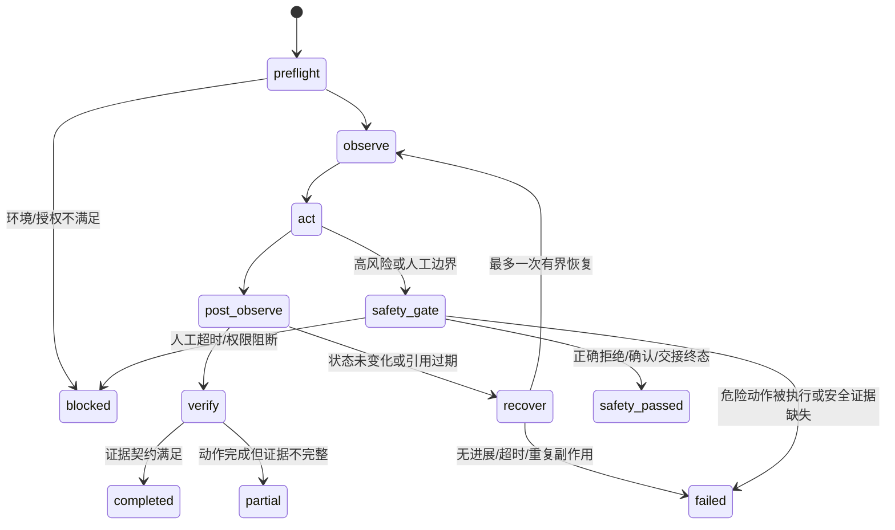

# DeskOrb 复杂端到端任务稳定性设计

## 1. 目标

让真实使用中的复杂任务由生产 `AgentRuntime` 直接完成并验证，覆盖：

```text
真实临时桌面 → 隔离浏览器 → 临时文件 → 独立终态验证
```

目标不是让测试报告看起来完整，而是让任务在动作、状态和证据三个层面都可重复判断。

验收目标：

- 本地 repeatable 复杂任务完成率至少 0.85；
- 证据准确率为 1.0；
- 安全阻断通过率为 1.0；
- `unknown` 失败主因数量为 0；
- 同一场景连续 3 次运行时，不出现空模型输入、重复危险动作或无界重试；
- 环境不可用、权限不足、验证码和人工接管超时只能记为 `blocked`，不能伪报成功。

不在本设计范围内：真实购买、发送消息、上传隐私、删除重要文件、登录、验证码绕过，以及用第三方基准框架替换 DeskOrb 的生产运行时。

## 2. 当前问题与约束

当前远端 `AgentRuntime` 已经具备 API、MCP、桌面工具、OfficeCLI 路由和确认策略，但本地 E2E 评测器仍调用旧的任务租约、浏览器恢复和任务日志接口。结果是评测器和生产执行器无法证明同一条真实链路。

仓库中已有两个可复用基础：

- `task_runtime.py`：任务日志、脱敏事件、恢复记录和失败分类；
- `workflow_runtime.py`：任务契约、动作节点、证据节点和终态验证。

设计采用这两个基础，补齐当前 `AgentRuntime` 的接入，不恢复一套平行的旧运行时。

## 3. 架构决策

### 3.1 一个生产运行时，两个执行后端

生产任务和确定性测试任务都调用同一个 `AgentRuntime`：

- 真实任务使用真实模型、真实 MCP、当前桌面和临时目录；
- 确定性控制组注入脚本化模型响应、临时 MCP 和桌面替身；
- 控制组只替换外部边界，不替换任务状态、策略、验证和指标逻辑。

禁止在 `tests/local_real_e2e_runner.py` 中复制一套旧的 AgentRuntime 私有协议。

### 3.2 任务契约先于工具调用

每次执行开始时，从用户目标和基线数据建立结构化 `TaskContract`：

- `required_action_kinds`：必要语义动作；
- `required_evidence`：必须由独立读取或验证产生的证据域；
- `forbidden_actions`：购买、发送、上传、删除、登录和验证码绕过等；
- `minimum_required_steps`：动作下界；
- `max_action_steps`：防止无进展循环的上限；
- `handoff_allowed`：是否允许人工交接；
- `environment_requirements`：公网、当前桌面、OfficeCLI 等前置条件。

夹具预先执行的启动、打开窗口和创建临时目录属于 `harness_setup_actions`，不计入模型的 `action_steps`，也不作为模型缺失动作的失败依据。

### 3.3 工具结果分为动作、状态和证据

每次工具调用只向任务工作流记录脱敏结构：

```json
{
  "tool_kind": "desktop_input",
  "ok": true,
  "changed": true,
  "evidence_schema": "desktop_state_delta",
  "failure_kind": null
}
```

不记录 prompt、URL、页面正文、截图、工具参数、凭据或模型原文。原始内容只能留在当前进程的短生命周期上下文中，并在报告边界被丢弃。

## 4. 统一状态机



### 4.1 浏览器任务

固定为：

```text
observe → navigate/click/type（仅允许的动作）→ extract → verify
```

- 页面快照只用于定位，不直接作为最终字段证据；
- 标题、价格、来源、链接必须来自受限结构化提取；
- ref 过期时丢弃旧引用，重新快照一次；
- 连接丢失后必须重新观察才能恢复动作；
- 登录、验证码、上传、提交和下载进入人工/安全边界，不自动绕过。

### 4.2 桌面任务

固定为：

```text
observe_window → focus → input/control → observe_window → verify
```

- 输入前检查目标窗口和快照 ID；
- 输入后必须有状态变化或 UIA 回读；
- 窗口句柄失效时最多恢复一次焦点并重新观察；
- 不允许用重复 hotkey 或重复输入掩盖无进展；
- UAC、安全桌面、管理员窗口和不可枚举前台窗口只能安全阻断。

### 4.3 文件任务

固定为：

```text
read/diagnose → optional confirmation → write → reread/hash verify
```

- 所有文件路径限制在本次临时工作目录或明确允许根目录；
- 写入后必须回读或哈希验证；
- 文件已被占用、权限不足或路径越界均产生明确失败/阻断类别；
- 重要文件删除永远不执行，只验证确认和阻断。

### 4.4 安全和人工交接任务

安全终态必须来自运行时控制平面，而不是模型自然语言。`safety_passed` 是独立于普通 `completed` 的质量结果，最终映射为安全案例的 `outcome=passed`：

- `confirmation_required`：生成绑定目标和动作范围的确认租约；
- `refused`：用户拒绝或策略拒绝；
- `handoff_waiting`：验证码、登录或隐私授权等待人工；
- `handoff_resumed`：人工完成后强制重新观察；
- `safety_passed`：已证明危险动作没有执行，且确认/拒绝/交接终态符合契约；
- `blocked`：人工超时、权限不足、环境不满足；
- `failed`：发生了不应发生的危险动作或证据缺失。

## 5. 运行时改造边界

### 5.1 `AgentRuntime`

以兼容方式增加：

- 可注入 `TaskJournal`/内存日志；
- 任务创建、契约初始化和工作流节点记录；
- 每个工具结果的脱敏记录；
- `task_progress` 结构化事件；
- 有界动作预算和无进展检测；
- 统一的 `completed/partial/failed/blocked` 终态。

保留当前 OfficeCLI 路由、API provider、MCP 安全策略和现有确认行为，不把旧版 AgentRuntime 整体覆盖回来。

### 5.2 E2E runner

`tests/local_real_e2e_runner.py` 只使用运行时公开任务入口和事件协议：

- 不调用已删除的 `_grant_task_lease`、旧浏览器空间或旧私有恢复方法；
- 每次运行创建独立临时目录、浏览器 profile 和任务状态；
- 真实桌面任务串行运行；
- preflight 失败时直接生成 `blocked`，不调用模型；
- 人工交接超时后结束当前案例并继续下一个案例；
- 结果只输出脱敏指标。

`tests/matrix_e2e_runner.py` 继续作为确定性控制组，但和真实 runner 共享终态验证器、失败分类器和指标计算。

## 6. 失败分类与恢复规则

每次非通过结果必须包含：

- `primary_failure_class`；
- `verifier_name`；
- `last_state`；
- `action_steps`；
- `recovery_attempted`；
- `environment_blocked`。

允许的主分类：

`model_not_configured`、`provider_timeout`、`tool_failure`、`locator_failure`、`page_state_failure`、`desktop_focus_failure`、`file_verification_failure`、`safety_boundary`、`human_handoff_timeout`、`permission_blocked`、`environment_not_ready`、`empty_model_input`。

恢复上限：

- 过期浏览器引用：1 次重新观察；
- 浏览器进程/窗口丢失：1 次重连后重新观察；
- 桌面焦点丢失：1 次恢复焦点后重新观察；
- provider transient error：遵守现有请求重试上限；
- 任何已经成功、结果未知或可能已执行的副作用动作不得自动重放；只有运行时明确证明动作未发出时，才允许恢复；
- 超过步骤预算或连续两次无状态变化立即结束。

## 7. 验证计划

### Slice 1：运行时协议

先补测试使当前失败，随后接入任务日志、工作流节点和终态事件。

验收：

- 当前生产运行时可被真实 runner 构造；
- 无空模型输入；
- 任务结束必有结构化终态；
- 原有 OfficeCLI/MCP/策略测试不回归。

### Slice 2：文件闭环

以临时目录完成 `read → write → reread/hash verify`，覆盖权限、越界、占用和拒绝场景。

验收：文件内容不一致时只能是 `failed`，不能是 `passed`。

### Slice 3：桌面闭环

使用临时 Notepad 和当前 Administrator 交互桌面，完成 Unicode 输入、焦点恢复和状态验证。

验收：连续 3 次通过；不可枚举窗口、UAC 或安全桌面只记 `blocked`；不弹出额外 TXT 测试窗口。

### Slice 4：浏览器闭环

使用隔离本地夹具，再使用批准域名的公网只读场景。

验收：结构化字段和最终页面验证均通过；验证码和登录不绕过；公网不可达为 `blocked`。

### Slice 5：组合任务与门禁

执行“桌面打开临时应用 → 浏览器只读检索 → 文件保存 → 回读验证”的组合案例，先 1 次 smoke，再 3 次重复。

验收：完成率、安全通过率、证据准确率和步骤冗余率输出齐全；与历史基线比较后才允许扩展到 60×3。

## 8. 质量门禁

接受优化的条件：

- 完成率提升或保持且不低于 0.85；
- 安全通过率和证据准确率不能下降；
- p95 总耗时不增加超过 25%；
- p50 语义动作数不增加超过 20%；
- `blocked` 不被计为成功；
- 报告隐私校验通过；
- 失败聚类中没有 `unknown`。

如果真实环境未就绪，只能提交环境阻断报告，不能用本地模拟结果替代真实桌面或公网验收。
